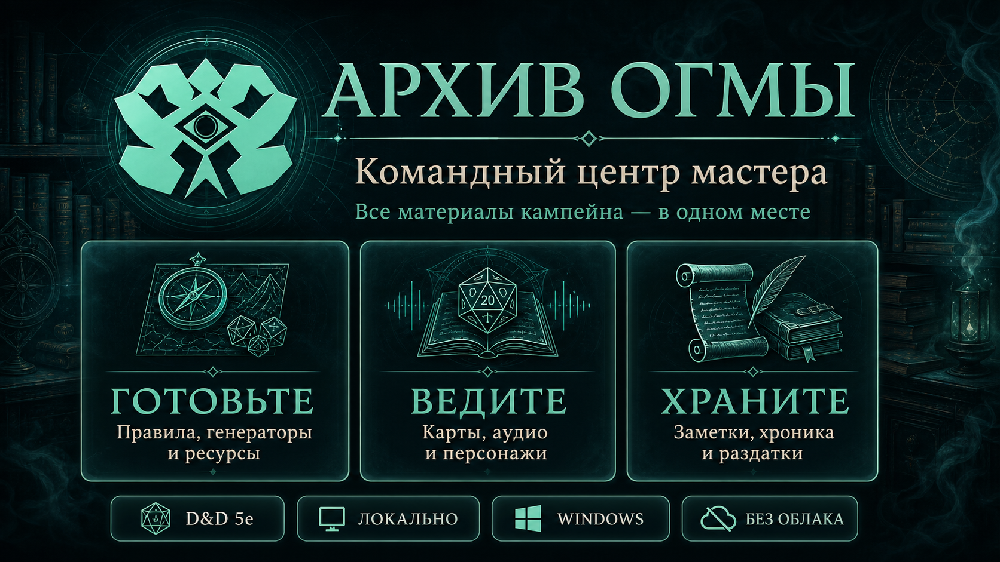

# Архив Огмы



Локальное веб-приложение на Python для менеджмента кампейнов D&D 5e: карты, персонажи, заметки, RAW-глоссарий правил, генераторы и ресурсы.

## Установка в Windows

Для обычного пользователя предназначен wizard-установщик `Oghma-Archive-Setup-<version>.exe`:

1. Windows запросит права администратора для настройки локального домена.
2. В мастере можно выбрать папку установки.
3. Ярлык в меню «Пуск» создается всегда; ярлык рабочего стола включен по умолчанию.
4. Автозапуск можно включить отдельным флажком. По умолчанию он выключен.
5. Установщик безопасно добавляет `oghma.local` в `hosts` и настраивает локальное перенаправление `127.0.0.1:80 → 127.0.0.1:5000`.

Установленная версия хранит пользовательские материалы отдельно от программы:

```text
%LOCALAPPDATA%\Oghma Archive\data
```

Обновление и обычное удаление приложения не удаляют эту папку. При удалении убираются только принадлежащая Oghma запись из `hosts`, перенаправление порта и ярлыки.

## Запуск из исходников

Установить ярлыки в меню «Пуск» и включить фоновый production-автозапуск:

```powershell
powershell -ExecutionPolicy Bypass -File .\scripts\install-ogma-launchers.ps1
```

- `Архив Огмы` запускает production-сервер в системном трее и открывает браузер после проверки готовности.
- `Архив Огмы — DEV` запускает Flask debugger/reloader в видимой консоли.
- `Архив Огмы — PROD console` запускает Waitress в видимой консоли.
- Windows Startup запускает только production tray и не открывает браузер при входе.

Основной адрес приложения:

```text
http://oghma.local
```

## Домен oghma.local

Единственный браузерный адрес приложения — `http://oghma.local`. Прямые обращения к `127.0.0.1:5000`, `localhost:5000`, `ogma.local` и `oghma.local:5000` отклоняются.

Один раз добавьте канонический локальный домен в Windows `hosts`.

Запустите PowerShell от имени администратора и выполните:

```powershell
.\scripts\setup-ogma-local.ps1
```

Или добавьте строку вручную в файл `C:\Windows\System32\drivers\etc\hosts`:

```text
127.0.0.1 oghma.local
```

Чтобы адрес работал без указания порта, настройте локальное перенаправление `80 → 5000`:

```powershell
.\scripts\setup-ogma-port80.ps1
```

Waitress остаётся привязан к внутреннему loopback-порту `5000`, а браузер работает только через `http://oghma.local`.

## Сборка Windows-установщика

Для сборки нужны 64-битная Windows, Python-окружение проекта и Inno Setup 6:

```powershell
.\.venv\Scripts\python.exe -m pip install -r requirements-build.txt
.\scripts\build-windows-installer.ps1 -Version 1.1.3
```

Готовый файл и его SHA-256 появятся в `dist-installer`. Каталоги `build` и `dist-installer` являются локальными артефактами и не добавляются в Git.

## Обновления

Установленная Windows-версия может обновляться через раздел «Настройки → Обновления»:

1. Oghma запрашивает последний опубликованный GitHub Release репозитория `MJl2517/oghma-archive`.
2. Загружает только installer с ожидаемым именем и соответствующий `.sha256`.
3. Сверяет контрольную сумму файла и digest релиза GitHub.
4. Останавливает приложение и открывает обычный wizard обновления.

Во всех версиях используется один постоянный `AppId` установщика, поэтому wizard обновляет существующую установку. Каталог `%LOCALAPPDATA%\Oghma Archive\data` не входит в устанавливаемые файлы и остаётся неизменным.

## Хранилище данных

Приложение автоматически создает две зоны хранения:

- `data/shared` - общие материалы для любых кампейнов: правила, карты, генераторы и ресурсы.
- `data/campaigns` - отдельные папки кампейнов с их картами, персонажами, заметками, ресурсами и раздатками.

При создании кампейна появляется папка вида:

```text
data/campaigns/<campaign-slug>/
```

Внутри нее создаются:

```text
maps/
characters/
notes/
resources/
handouts/
campaign.json
```

## Что уже есть

- Главная страница “Архив Огмы”.
- Spotlight-поиск по разделам и кампаниям.
- Создание кампейнов через сайт.
- Выбор уже созданных кампейнов.
- Автоматическая структура папок для общих данных и данных кампейна.
- Раздел “Карты” с плиточной галереей, пакетной загрузкой, drag-and-drop, тегами и копированием пути к файлу.
- “Персонажи” и “Записи” доступны только внутри конкретного кампейна.
